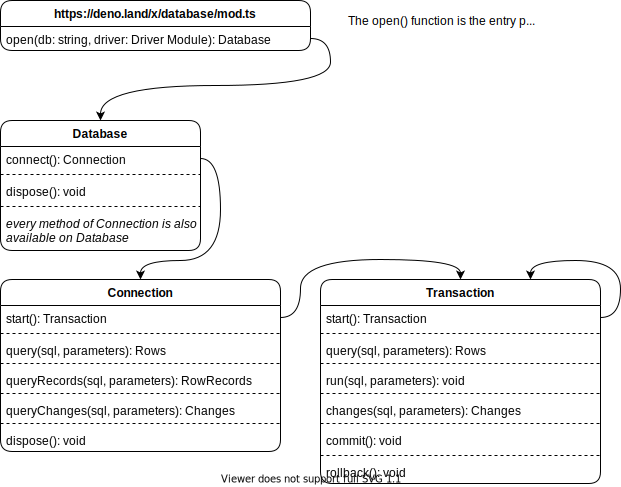
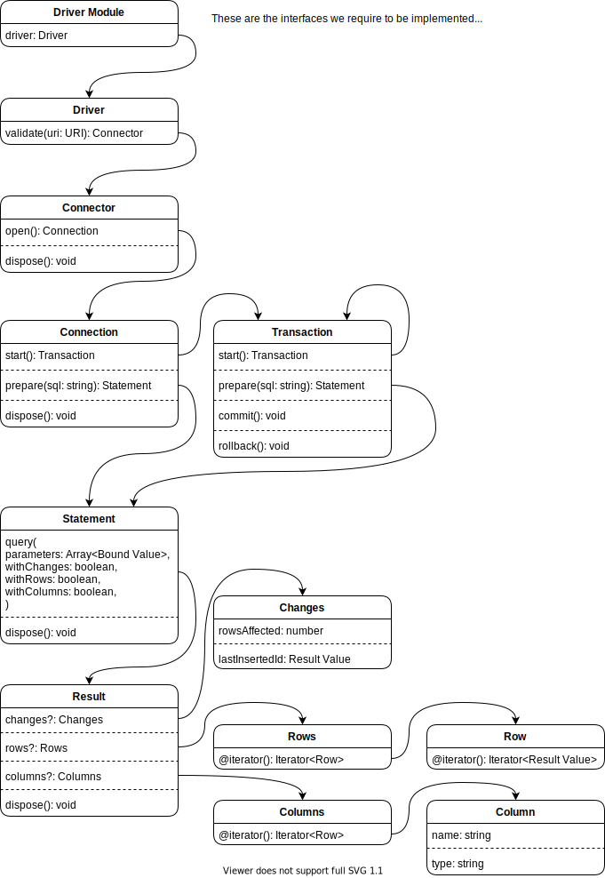

# Docs

Generated API documentation is available on Deno Doc:

- [x/database/sql/sql.ts](https://doc.deno.land/https/deno.land/x/database/sql.ts)
- [x/database/sql/driver.ts](https://doc.deno.land/https/deno.land/x/database/driver.ts)

We have RFC documents and review discussions describing some past design
decisions, but note their dates as things may have changed since they were
written:

- [x/database/sql for Deno, Version 0.1](./rfcs/0003-initial.md)

